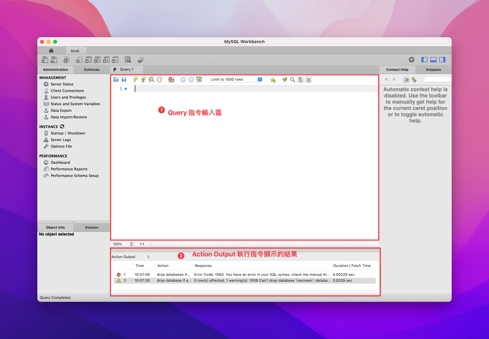
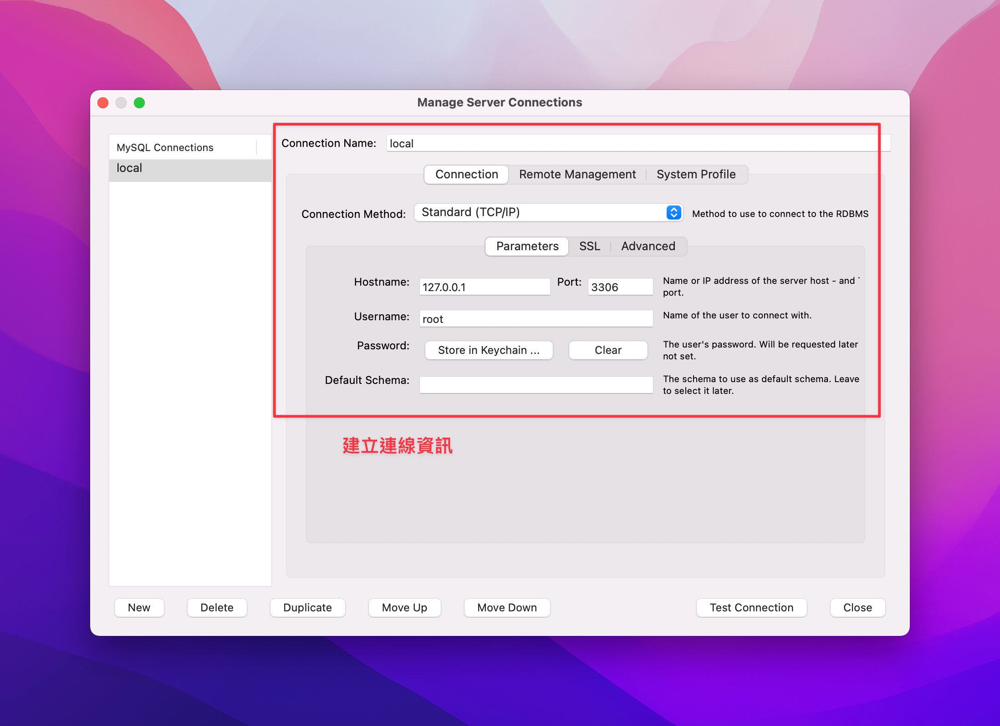

MySQL 簡易的 SQL 練習
1. 新增名為 menu 的資料庫
2. 在 menu 新增一個叫 type 的資料表，並且定義 schema:id、name，寫進四種資料，漢堡、吐司、蛋餅、乳酪餅

## 下載 MySQL WorkBench
MySQL WorkBench 是一套 MYSQL UI 軟體，方便我們建立資料庫、查詢資料庫的內容、將資料新增至資料庫
由於 Hazel 是使用 Mac x86系統，並非m1晶片，故選擇「macOS 11 (x86, 64-bit)」下載

MacOS 官方下載：[連結](https://dev.mysql.com/downloads/mysql)


## 設定 localhost 本地資料庫
- Connection Name: 任意取名，我取名叫 local
- Connection Method: Standard(TCP/IP)
- Hostname: 127.0.0.1
- Port: 3006
- Username: root
- Password: 我設定 password，安裝mysql時初始化密碼填什麼這邊就填什麼



## 建立資料庫
建立資料庫前，按照習慣來說會先確定是否已存在同名的資料庫，如果有，則會先刪除資料庫
``` sql
drop database if exists menus;
```
再開始建立新的資料庫 menus，並使用 menus 資料庫
```
create database menus;
use menus;
```

## 建立 Table
我們將建立一個 type 的類型資料表，裡面會存放早餐種類
設定的屬性會有
- id，並設定自動累加，id1、id2、...每新增一筆資料id會自動增加，`auto_increment`
- name，名稱，不允許空值的字串 `NOT NULL`
- 以id作為不重複的主鍵 `primary key`
``` sql
create table `type` (
  `id` INT( 11 ) auto_increment,
  `name` VARCHAR( 255 ) NOT NULL,
  primary key (`id`)
)
```

## 插入資料

``` sql
use menus;
insert into `type` (name) values ('hamburger');
insert into `type` (name) values ('toast');
insert into `type` (name) values ('chinese omelet');
insert into `type` (name) values ('cheese flatbread');
```

最後插入完資料後我們可以下 `select` 指令來查看成果
``` sql
select * from `menus`;
```

## 完整 SQL
``` sql
drop database if exists menus;
create database menus;
use menus;


create table `types` (
	`id` INT(11) auto_increment,
    `name` VARCHAR( 255 ) NOT NULL,
    primary key (`id`)
);

insert into `types` (name) values ('egg');
insert into `types` (name) values ('hamburger');

SELECT * FROM menus.types;
```

## 新手知識
1. SQL 指令每一行必須要有冒號「;」做為結尾
2. SQL 非「case sensitive」語言，輸入大小寫皆視為相同，如果要特別區分大小寫，需要使用反引號 `，這樣 SQL 才會將反引號的內容視為「字串」，而非動作的關鍵字
3. MYSQL WorkBench [使用指南](https://dev.mysql.com/doc/workbench/en/wb-intro.html)